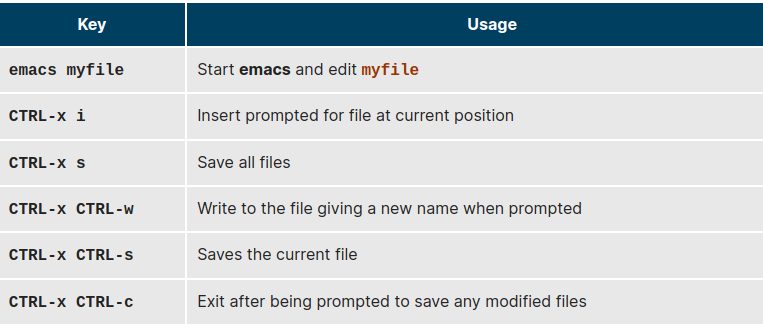

The **emacs** editor is a popular competitor for vi. Unlike vi, it does not work with modes. emacs is highly customizable and includes a large number of features. It was initially designed for use on a console, but was soon adapted to work with a GUI as well. emacs has many other capabilities other than simple text editing. For example, it can be used for email, debugging, etc.

Rather than having different modes for command and insert, like vi, emacs uses the CTRL and Meta (Alt or Esc) keys for special commands.

The table lists some of the most important key combinations that are used when starting, exiting, reading, and writing files in emacs.

The emacs tutorial is a good place to start learning basic commands. It is available any time when in emacs by simply typing CTRL-h (for help) and then the letter t for tutorial.